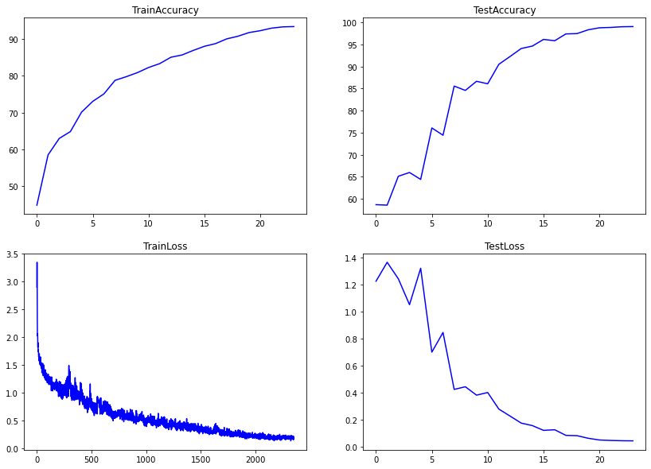
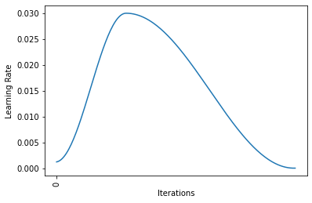
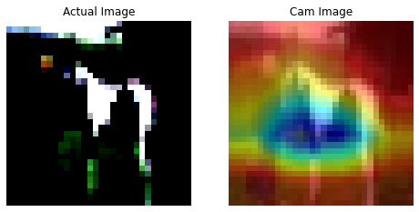
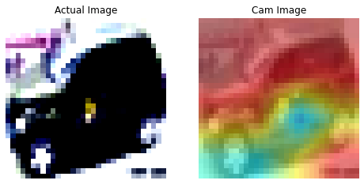
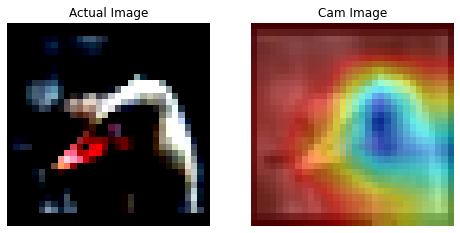

<br/>
<h1 align="center">Session 9: RESNETS AND HIGHER RECEPTIVE FIELDS
<br/>
<!-- toc -->
    <br>
    
[](https://lbesson.mit-license.org/)
[](https://github.com/RajamannarAanjaram/badges/)
[](https://github.com/RajamannarAanjaram/badges)
    <br>
[](https://www.python.org/)
[](https://GitHub.com/RajamannarAanjaram/)

### Contributors

<p align="center"> <b>Team - 6</b> <p>
    
| <centre>Name</centre> | <centre>Mail id</centre> | 
| ------------ | ------------- |
| <centre>Amit Agarwal</centre>         | <centre>amit.pinaki@gmail.com</centre>    |
| <centre>Pranav Panday</centre>         | <centre>pranavpandey2511@gmail.com</centre>    |
| <centre>Rajamannar A K</centre>         | <centre>rajamannaraanjaram@gmail.com</centre>    |
| <centre>Sree Latha Chopparapu</centre>         | <centre>sreelathaemail@gmail.com</centre>    |\\

<!-- toc -->
    
## Problem Statement

Write a custom ResNet architecture for CIFAR10 that has the following architecture:
 - PrepLayer - Conv 3x3 s1, p1) >> BN >> RELU [64k]
 - Layer1 -
    - X = Conv 3x3 (s1, p1) >> MaxPool2D >> BN >> RELU [128k]
    - R1 = ResBlock( (Conv-BN-ReLU-Conv-BN-ReLU))(X) [128k] 
    - Add(X, R1)
- Layer 2 -
    - Conv 3x3 [256k]
    - MaxPooling2D
    - BN
    - ReLU
- Layer 3 -
    - X = Conv 3x3 (s1, p1) >> MaxPool2D >> BN >> RELU [512k]
    - R2 = ResBlock( (Conv-BN-ReLU-Conv-BN-ReLU))(X) [512k]
    - Add(X, R2)
- MaxPooling with Kernel Size 4
- FC Layer 
- SoftMax
- Uses One Cycle Policy such that:
    - Total Epochs = 24
    - Max at Epoch = 5
    - LRMIN = FIND
    - LRMAX = FIND
    - NO Annihilation
- Uses this transform -RandomCrop 32, 32 (after padding of 4) >> FlipLR >> Followed by - CutOut(8, 8)
- Batch size = 512
- Target Accuracy: 90% (93% for late submission or double scores). 
- NO score if your code is not modular. Your collab must be importing your GitHub package, and then just running the model. I should be able to find the custom_resnet.py model in your GitHub repo that you'd be training. 

## Model training log
```

  0%|          | 0/98 [00:00<?, ?it/s]
Epoch 1:
Loss=1.3255488872528076 Batch_id=97 Accuracy=44.81: 100%|██████████| 98/98 [00:32<00:00,  3.05it/s]
  0%|          | 0/98 [00:00<?, ?it/s]

Test set: Average loss: 1.2241, Accuracy: 29340/50000 (58.68%)

Epoch 2:
Loss=1.0536190271377563 Batch_id=97 Accuracy=58.47: 100%|██████████| 98/98 [00:31<00:00,  3.07it/s]
  0%|          | 0/98 [00:00<?, ?it/s]

Test set: Average loss: 1.3646, Accuracy: 29288/50000 (58.58%)

Epoch 3:
Loss=1.4940125942230225 Batch_id=97 Accuracy=62.95: 100%|██████████| 98/98 [00:31<00:00,  3.08it/s]
  0%|          | 0/98 [00:00<?, ?it/s]

Test set: Average loss: 1.2424, Accuracy: 32562/50000 (65.12%)

Epoch 4:
Loss=0.9044066071510315 Batch_id=97 Accuracy=64.81: 100%|██████████| 98/98 [00:31<00:00,  3.08it/s]
  0%|          | 0/98 [00:00<?, ?it/s]

Test set: Average loss: 1.0506, Accuracy: 32987/50000 (65.97%)

Epoch 5:
Loss=0.9340430498123169 Batch_id=97 Accuracy=70.10: 100%|██████████| 98/98 [00:31<00:00,  3.11it/s]
  0%|          | 0/98 [00:00<?, ?it/s]

Test set: Average loss: 1.3204, Accuracy: 32203/50000 (64.41%)

Epoch 6:
Loss=0.7962889671325684 Batch_id=97 Accuracy=73.02: 100%|██████████| 98/98 [00:31<00:00,  3.12it/s]
  0%|          | 0/98 [00:00<?, ?it/s]

Test set: Average loss: 0.6991, Accuracy: 38037/50000 (76.07%)

Epoch 7:
Loss=0.5998490452766418 Batch_id=97 Accuracy=75.05: 100%|██████████| 98/98 [00:31<00:00,  3.13it/s]
  0%|          | 0/98 [00:00<?, ?it/s]

Test set: Average loss: 0.8447, Accuracy: 37212/50000 (74.42%)

Epoch 8:
Loss=0.6143016815185547 Batch_id=97 Accuracy=78.74: 100%|██████████| 98/98 [00:31<00:00,  3.13it/s]
  0%|          | 0/98 [00:00<?, ?it/s]

Test set: Average loss: 0.4230, Accuracy: 42782/50000 (85.56%)

Epoch 9:
Loss=0.5174098610877991 Batch_id=97 Accuracy=79.74: 100%|██████████| 98/98 [00:31<00:00,  3.11it/s] 
  0%|          | 0/98 [00:00<?, ?it/s]

Test set: Average loss: 0.4427, Accuracy: 42289/50000 (84.58%)

Epoch 10:
Loss=0.5649438500404358 Batch_id=97 Accuracy=80.84: 100%|██████████| 98/98 [00:31<00:00,  3.14it/s] 
  0%|          | 0/98 [00:00<?, ?it/s]

Test set: Average loss: 0.3804, Accuracy: 43324/50000 (86.65%)

Epoch 11:
Loss=0.44581350684165955 Batch_id=97 Accuracy=82.24: 100%|██████████| 98/98 [00:31<00:00,  3.14it/s]
  0%|          | 0/98 [00:00<?, ?it/s]

Test set: Average loss: 0.4000, Accuracy: 43043/50000 (86.09%)

Epoch 12:
Loss=0.5203299522399902 Batch_id=97 Accuracy=83.30: 100%|██████████| 98/98 [00:31<00:00,  3.16it/s] 
  0%|          | 0/98 [00:00<?, ?it/s]

Test set: Average loss: 0.2771, Accuracy: 45252/50000 (90.50%)

Epoch 13:
Loss=0.4236239492893219 Batch_id=97 Accuracy=85.02: 100%|██████████| 98/98 [00:31<00:00,  3.15it/s] 
  0%|          | 0/98 [00:00<?, ?it/s]

Test set: Average loss: 0.2258, Accuracy: 46131/50000 (92.26%)

Epoch 14:
Loss=0.5394148826599121 Batch_id=97 Accuracy=85.64: 100%|██████████| 98/98 [00:31<00:00,  3.15it/s] 
  0%|          | 0/98 [00:00<?, ?it/s]

Test set: Average loss: 0.1735, Accuracy: 47037/50000 (94.07%)

Epoch 15:
Loss=0.32538342475891113 Batch_id=97 Accuracy=86.88: 100%|██████████| 98/98 [00:31<00:00,  3.15it/s]
  0%|          | 0/98 [00:00<?, ?it/s]

Test set: Average loss: 0.1549, Accuracy: 47317/50000 (94.63%)

Epoch 16:
Loss=0.4038628935813904 Batch_id=97 Accuracy=88.00: 100%|██████████| 98/98 [00:30<00:00,  3.16it/s] 
  0%|          | 0/98 [00:00<?, ?it/s]

Test set: Average loss: 0.1196, Accuracy: 48069/50000 (96.14%)

Epoch 17:
Loss=0.37232092022895813 Batch_id=97 Accuracy=88.73: 100%|██████████| 98/98 [00:31<00:00,  3.15it/s]
  0%|          | 0/98 [00:00<?, ?it/s]

Test set: Average loss: 0.1242, Accuracy: 47921/50000 (95.84%)

Epoch 18:
Loss=0.26158079504966736 Batch_id=97 Accuracy=90.02: 100%|██████████| 98/98 [00:31<00:00,  3.16it/s]
  0%|          | 0/98 [00:00<?, ?it/s]

Test set: Average loss: 0.0826, Accuracy: 48693/50000 (97.39%)

Epoch 19:
Loss=0.29752883315086365 Batch_id=97 Accuracy=90.74: 100%|██████████| 98/98 [00:31<00:00,  3.13it/s]
  0%|          | 0/98 [00:00<?, ?it/s]

Test set: Average loss: 0.0802, Accuracy: 48732/50000 (97.46%)

Epoch 20:
Loss=0.24206402897834778 Batch_id=97 Accuracy=91.74: 100%|██████████| 98/98 [00:31<00:00,  3.14it/s]
  0%|          | 0/98 [00:00<?, ?it/s]

Test set: Average loss: 0.0611, Accuracy: 49160/50000 (98.32%)

Epoch 21:
Loss=0.1807435005903244 Batch_id=97 Accuracy=92.24: 100%|██████████| 98/98 [00:31<00:00,  3.13it/s] 
  0%|          | 0/98 [00:00<?, ?it/s]

Test set: Average loss: 0.0483, Accuracy: 49387/50000 (98.77%)

Epoch 22:
Loss=0.18420866131782532 Batch_id=97 Accuracy=92.93: 100%|██████████| 98/98 [00:31<00:00,  3.15it/s]
  0%|          | 0/98 [00:00<?, ?it/s]

Test set: Average loss: 0.0451, Accuracy: 49429/50000 (98.86%)

Epoch 23:
Loss=0.21904274821281433 Batch_id=97 Accuracy=93.28: 100%|██████████| 98/98 [00:31<00:00,  3.14it/s]
  0%|          | 0/98 [00:00<?, ?it/s]

Test set: Average loss: 0.0429, Accuracy: 49504/50000 (99.01%)

Epoch 24:
Loss=0.1683892160654068 Batch_id=97 Accuracy=93.36: 100%|██████████| 98/98 [00:31<00:00,  3.14it/s] 

Test set: Average loss: 0.0421, Accuracy: 49525/50000 (99.05%)

```


## Plots

### Training & Loss Curves


### LR Scheduler

<hr>

## Misclassifications

Below are examples of some missclassified examples in the test set.  


## Grad-CAM outputs

Below are 10 grad-cam example images for misclasified examples in the test set.  








